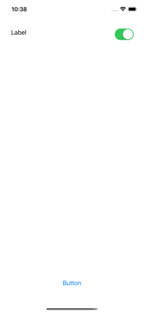
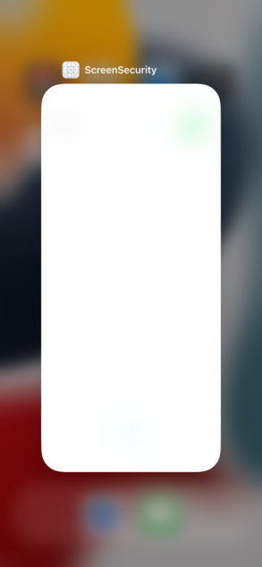
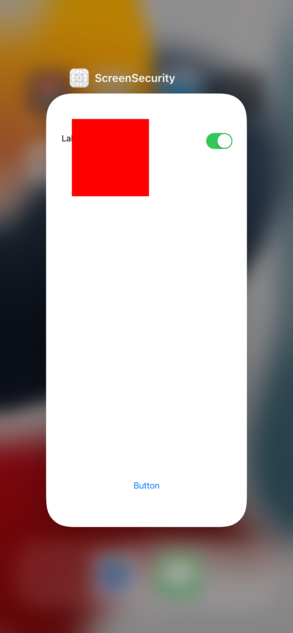

# ScreenSecuritySDK

Secure your app hiding sensitive informations, easily.


### Capabilities:  
- Detect screen **mirroring** (Airplay, Mirroring...)
- Detect screen **recording** (iOS screen record)
- Detect **QuickTime** recording (macOS QuickTime)
- Detect user **screenshots** (*no avoid, only detect*)
- Detect iOS **cached** screens: `/var/mobile/Applications/[APP ID]/Library/Caches/Snapshots/com.AppName/`


### How to use:

Add this repo as **Package Manager**.

`import ScreenSecuritySDK`

-

What you need to make it works is a `UIWindow`.  
It's suggested to implement in `UISceneDelegate` or `UIApplicationDelegate`, depending on your implementation.

```
var screenSecurity: ScreenSecurity?

[...]

func scene(_ scene: UIScene, willConnectTo session: UISceneSession, options connectionOptions: UIScene.ConnectionOptions) {

    screenSecurity = ScreenSecurity( window! )

}

```
--

#### Security Types
The allowed security types of detections are the following:

```
enum SecurityIdentifierType {
    case quickTime
    case screenRecording
    case mirroring
    case screenCache
    case screenshot
}
```
--

#### Security Rules

You can create your custom rules using `ScreenSecurityRules`, with custom callbacks, in this way:

```
let mirroringRule = ScreenSecurityRules {
	$0.type = .mirroring
	$0.callback = self.mirrorDetected
}
[...]
let screenRecordingRule = ScreenSecurityRules {
    $0.type = .screenRecording
    $0.callback = self.screenRecordingDetected
}
```

you can append the parameters you need, generally is enough the `type`. The `callback` is optional.

##### Callbacks

Callbacks can used as single functions or directly in the declaration:

Example: 

```
var mirrorDetected: (Any?, Bool) -> Void = { (arg: Any?, status: Bool) -> Void in
    print("mirrorDetected: \(status)")
}    
```

or inside rule:

```
let mirroringRule = ScreenSecurityRules {
    $0.type = .mirroring
    $0.callback = (arg: Any?, status: Bool) -> Void in {
	    print("mirrorDetected: \(status)")
    }
}
```

--

In case you implement the `SecurityIdentifierType.screenCache` rule, you need an additional parameter:  
`sceneDelegate` or `appDelegate` (depending on your implementation).

And you need also a call to method `screenSecurity?.listen()` in these delegates:

```
func sceneDidBecomeActive(_ scene: UIScene) {
    screenSecurity?.listen(type: .didBecomeActive)
}

func sceneWillResignActive(_ scene: UIScene) {
    screenSecurity?.listen(type: .willResignActive)
}

func sceneWillEnterForeground(_ scene: UIScene) {
    screenSecurity?.listen(type: .willEnterForeground)
}

func sceneDidEnterBackground(_ scene: UIScene) {
    screenSecurity?.listen(type: .didEnterBackground)
}
```

--

### Composing rules

Rules can be composed appending to an array of `[ScreenSecurityRules]` the created rules, example:

```
var rules = [ScreenSecurityRules]()
rules = [
    mirroringRule,
    quickTimeRule,
    screenRecordingRule,
    screenCacheRule,
    screenshotRule
]
```

### Configure SDK

To use the SDK you should call:

`screenSecurity?.configure(rules: rules, autoBlur: true)`

Params are:  
- `rules: [ScreenSecurityRules]`: the rules created before.  
- `autoBlue: Bool`: to use integrated window blur.  
- `customOverlay: UIView?`: a custom view that override integrated blur

--

**Original app screenshot**:  
  

**Integrated blur applied:**  
  

--

### Use custom view

If you don't want to use integrated blur, you can specify a custom view:

```
let customView = UIView(frame: CGRect(x: 50, y: 50, width: 150, height: 150))
customView.backgroundColor = .red

screenSecurity?.configure(rules: rules, autoBlur: false, customOverlay: customView)
```
In this way you'll see a red box instead of blur.

**Custom view applied:**  
  

--

Have fun.

